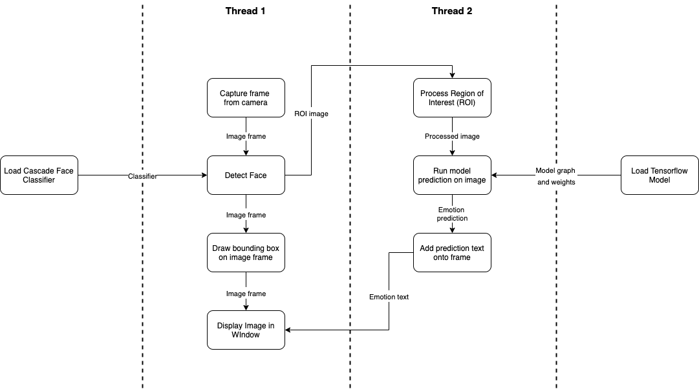

# Real-time Facial Emotion Recognition - CppND Capstone Project

## Introduction
This is the source code for a realtime facial emotion recognition application, which will be submitted for the capstone project of the Udacity C++ Nanodegree Program. The application will capture video from the laptop camera and recognise the facial expression or emotion displayed by the person's face. The user will be able to see the facial emotion prediction displayed on their screen in real-time.

**TODO: ADD a gif or image of the app working here**

## Detailed Description
Creating this app will involve the following steps:
1. Build a deep learning model using Keras/Tensorflow in Python. Freeze and save the model graph and weights as a .pb file. (See [here](https://github.com/martycheung/CppND-Facial-Emotion-Recognition/tree/master/model) for more details on how I built the model, the dataset and source code, but note that this was not in scope of the Udacity project)
2. Capture video using the laptop webcam in real-time using OpenCV.
3. Use the cascade face detector in OpenCV to detect a face and its location (for simplicity, one face will be detected at a time).
4. Draw a rectangular bounding box around the face (region of interest).
5. Preprocess the region of interest image to grayscale and resize to a 48x48 image, to match the input expected by the model.
6. Deploy model using the OpenCV Deep Neural Networks (dnn) module to do model inference on the image in the bounding box.
7. Display the video captured, along with the bounding box and the model prediction to the screen.

In order to make the code more efficient, the C++ code will be run in 2 threads. The 1st thread will consist of the video capture, face detection and drawing bounding box and video display, while the 2nd thread  will consist of preprocessing the image and model prediction. The result of the model prediction string will be fed back to the video display when it is ready. The c++ code structure is shown in the diagram below:

**TODO: Try to add multithreading to the program**

## Rubric Points Satisfied
1. The project demonstrates an understanding of C++ functions and control structures.
    - throughout project there are a variety of loops, functions etc.
2. The project reads data from a file and process the data, or the program writes data to a file.
    - the project reads in data from laptop camera, from external Tensorflow model and from an OpenCV face detector model.
3. The project uses Object Oriented Programming techniques.
    - Class structure consists of Camera, Image, FaceDetector and Model classes.
4. Classes use appropriate access specifiers for class members.
    - Class member variables and functions are explicitly specified as either public or private.
5. Class constructors utilize member initialization lists.
    - Yes for Model and Camera classes.
6. Classes abstract implementation details from their interfaces.
7. Classes encapsulate behavior.
8. The project makes use of references in function declarations.

## Dependencies for Running Locally (this project was run and tested on Mac)
* cmake >= 3.7
  * All OSes: [click here for installation instructions](https://cmake.org/install/)
* make >= 4.1 (Linux, Mac), 3.81 (Windows)
  * Linux: make is installed by default on most Linux distros
  * Mac: [install Xcode command line tools to get make](https://developer.apple.com/xcode/features/)
  * Windows: [Click here for installation instructions](http://gnuwin32.sourceforge.net/packages/make.htm)
* gcc/g++ >= 5.4
  * Linux: gcc / g++ is installed by default on most Linux distros
  * Mac: same deal as make - [install Xcode command line tools](https://developer.apple.com/xcode/features/)
  * Windows: recommend using [MinGW](http://www.mingw.org/)
* OpenCV == 4.3.0 (other versions may work but they are untested)

## Basic Build Instructions
1. Clone this repo.
2. Make a build directory in the top level directory: `mkdir build && cd build`
3. Compile: `cmake .. && make`
4. Run it: `./emotion_detector`.
