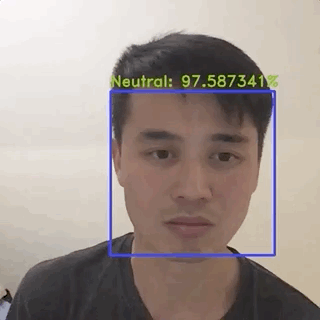
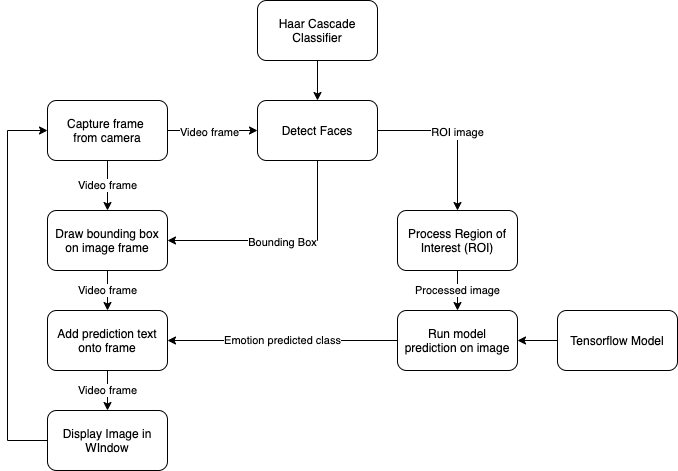

# Real-time Facial Emotion Recognition - CppND Capstone Project

## Introduction
This is the source code for a realtime facial emotion recognition application, which will be submitted for the capstone project of the Udacity C++ Nanodegree Program. The application will capture video from the laptop camera and recognise the facial expression as one of 7 emotions (eg. happy, sad, angry, disgust, surprise, fear, neutral) displayed by the person's face. The user will be able to see the facial emotion prediction displayed on their screen in real-time.

## Detailed Description
Below is a diagram of the code structure:

Creating this app will involve the following steps:  

1. Build a deep learning model using Keras/Tensorflow in Python. Freeze and save the model graph and weights as a .pb file. (See [here](https://github.com/martycheung/CppND-Facial-Emotion-Recognition/tree/master/model) for more details on how I built the model, the dataset and source code, but note that this was not in scope of the Udacity project)
2. Capture video using the laptop webcam in real-time using OpenCV.
3. Use the Haar Cascades face detector in OpenCV to detect each face and its location.
4. Draw a rectangular bounding box around the face (region of interest).
5. Preprocess the region of interest image to grayscale and resize to a 48x48 image, to match the input expected by the model.
6. Deploy model using the OpenCV Deep Neural Networks (dnn) module to do model inference on the image in the bounding box.
7. Display the video captured, along with the bounding box and the model prediction to the screen.

## Future Work
- In future work, in order to make the code run faster and smoother, I intend to add multithreading. The idea is that the main thread would read the video frame and display the video, while 1 thread does face detection and 1 thread does image processing and model prediction.
- This code can be applied easily many other face classification type applications such as age or gender classification, facial recognition etc. All that needs to be done is to change the tensorflow model that is used (and it doesn't even have to be tensorflow, Caffe, PyTorch and others can be used).
- A colleague suggested to try CORAL, a domain adaptation method to adapt the images from source domain (celebrity faces), to the target domain (laptop camera and my face). In essence we are pre-processing the target images so that they are more similar to the source images and therefore, the model inference could yield better results.

## Rubric Points Satisfied
1. The project demonstrates an understanding of C++ functions and control structures.
2. The project reads data from a file and process the data, or the program writes data to a file.
3. The project uses Object Oriented Programming techniques.
4. Classes use appropriate access specifiers for class members.
5. Class constructors utilize member initialization lists.
6. Classes abstract implementation details from their interfaces.
7. Classes encapsulate behavior.
8. The project makes use of references in function declarations.

## Dependencies for Running Locally (this project was run and tested on Mac)
* cmake >= 3.7
* make >= 4.1 (Linux, Mac), 3.81 (Windows)
* gcc/g++ >= 5.4
* OpenCV == 4.3.0 (other versions may work but they are untested)
* tensorflow <= 1.15 (for python notebooks only)

## Basic Build Instructions
1. Clone this repo.
2. Make a build directory in the top level directory: `mkdir build && cd build`
3. Compile: `cmake .. && make`
4. Run it: `./emotion_detector`.
